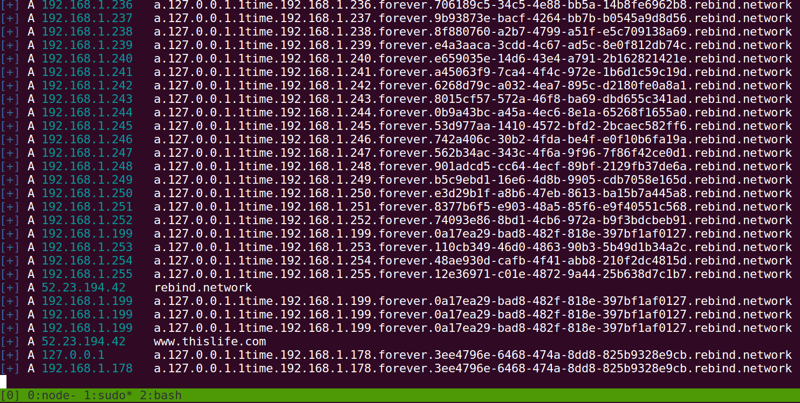

# Whonow DNS Server

A malicious DNS server for executing [DNS Rebinding attacks](https://en.wikipedia.org/wiki/DNS_rebinding) on the fly. `whonow` lets you specify DNS responses and rebind rules dynamically *using domain requests themselves*.

```bash
# respond to DNS queries for this domain with 52.23.194.42 the first time
# it is requested and then 192.168.1.1 every time after that
A.52.23.194.42.1time.192.168.1.1.forever.rebind.network

# respond first with 52.23.194.42, then 192.168.1.1 the next five times,
# and then start all over again (1, then 5, forever...)
A.52.23.194.42.1time.192.168.1.1.5times.repeat.rebind.network
```

What's great about dynamic DNS Rebinding rules is that you don't have to spin up your own malicious DNS server to start exploiting the browser's [Same-origin policy](https://en.wikipedia.org/wiki/Same-origin_policy). Instead, everyone can share the same public `whonow` server running on port 53 of `rebind.network`.

**Note**: You should include UUIDs (e.g. `a06a5856-1fff-4415-9aa2-823230b05826
`) as a subdomain in each DNS lookup to a `whonow` server. These have been omitted from examples in this README for brevity, but assume requests to `*.rebind.network` should be `*.a06a5856-1fff-4415-9aa2-823230b05826.rebind.network`. See the [Gotchas](#gotchas) section for more info as to why.

**DISCLAIMER: This software is for educational purposes only. This software should not be used for illegal activity. The author is not responsible for its use. Don't be a dick.**

## Subdomains = Rebind Rules

The beauty of `whonow` is that you can define the behavior of DNS responses via subdomains in the domain name itself. Using only a few simple keywords: `A`, `(n)times`, `forever`, and `repeat`, you can define complex and powerful DNS behavior.

### Anatomy of a `whonow` request

```
A.<ip-address>.<rule>[.<ip-address>.<rule>[.<ip-address>.<rule>]][.uuid/random-string].example.com
```

- `A`: The type of DNS request. Currently only `A` records are supported, but `AAAA` should be coming soon.
- `<ip-address>`: an ipv4 (ipv6 coming soon) address with each octet seprated by a period (e.g. `192.168.1.1`.
- `<rule>`: One of three rules
	- `(n)time[s]`: The number of times the DNS server should reply with the previous IP address. Accepts both plural and singular strings (e.g. `1time, 3times, 5000times`)
	- `forever`: Respond with the previous IP address forever.
	- `repeat`: Repeat the entire set of rules starting from the beginning.
- `[uuid/random-string]`: A random string to keep DNS Rebind attacks against the same IP addresses separate from each other. See [Gotchas](#gotchas) for more info.
- `example.com`: A domain name you have pointing to a `whonow` nameserver, like the publicly available `rebind.network:53` `whonow` instance.

Rules can be chained together to form complex response behavior.

### Examples

```
# always respond with 192.168.1.1. This isn't really DNS rebinding
# but it still works
A.192.168.1.1.forever.rebind.network

# alternate between localhost and 10.0.0.1 forever
A.127.0.0.1.1time.10.0.0.1.1time.repeat.rebind.network

# first respond with 192.168.1.1 then 192.168.1.2. Now respond 192.168.1.3 forever.
A.192.168.1.1.1time.192.168.1.2.2times.192.168.1.3.forever.rebind.network

# respond with 52.23.194.42 the first time, then whatever `whonow --default-address`
# is set to forever after that (default: 127.0.0.1)
A.52.23.194.42.1time.rebind.network
```

### Limitations

> Each label [subdomain] may contain zero to 63 characters... The full domain name may not exceed the length of 253 characters in its textual representation. (from the [DNS Wikipedia page](https://en.wikipedia.org/wiki/Domain_Name_System))

Additionally, there may not be more than 127 labels/subdomains.

## Gotchas

### Use Unique Domain Names

Each unique domain name request to `whonow` creates a small state-saving program in the server's RAM. The next time that domain name is requested the program counter increments and the state may be mutated. **All unique domain names are their own unique program instances**. To avoid clashing with other users or having your domain name program's state inadvertently incremented you should add a UUID subdomain after your rule definitions. That UUID should never be reused.

```
# this
A.127.0.0.1.1time.10.0.0.1.1time.repeat.8f058b82-4c39-4dfe-91f7-9b07bcd7fbd4.rebind.network

# not this
A.127.0.0.1.1time.10.0.0.1.1time.repeat.rebind.network
```

### `--max-ram-domains`

The program state associated with each unique domain name is stored by `whonow` in RAM. To avoid running out of RAM an upper-bound is placed on the number of unique domains who's program state can be managed at the same time. By default, this value is set to 10,000,000, but can be configured with the `--max-ram-domains`. Once this limit is reached, domain names and their saved program state will be removed in the order they were added (FIFO).

## Running your own `whonow` server

To run your own `whonow` server in the cloud use your domain name provider's admin panel to configure a custom nameserver pointing to your VPS. Then install `whonow` on that VPS and make sure it's running on port 53 (the default DNS port) and that port 53 is accessible to the Internet.

```bash
# install
npm install --cli -g whonow@latest

# run it!
whonow --port 53
```



If that ☝ is too much trouble, feel free to just use the public `whonow` server running on port 53 of `rebind.network`.🌐.

## Usage

```
$ whonow --help
usage: whonow [-h] [-v] [-p PORT] [-d DEFAULT_ANSWER] [-b MAX_RAM_DOMAINS]

A malicious DNS server for executing DNS Rebinding attacks on the fly.

Optional arguments:
  -h, --help            Show this help message and exit.
  -v, --version         Show program's version number and exit.
  -p PORT, --port PORT  What port to run the DNS server on (default: 53).
  -d DEFAULT_ANSWER, --default-answer DEFAULT_ANSWER
                        The default IP address to respond with if no rule is
                        found (default: "127.0.0.1").
  -b MAX_RAM_DOMAINS, --max-ram-domains MAX_RAM_DOMAINS
                        The number of domain name records to store in RAM at
                        once. Once the number of unique domain names queried
                        surpasses this number domains will be removed from
                        memory in the order they were requested. Domains that
                        have been removed in this way will have their program
                        state reset the next time they are queried (default:
                        10000000).
```

## Testing

A `whonow` server must be running on `localhost:15353` to perform the tests in `test.js`

```bash
# in one terminal
whonow -p 15353
```

```bash
# in another terminal
cd path/to/node_modules/whonow
npm test
```
